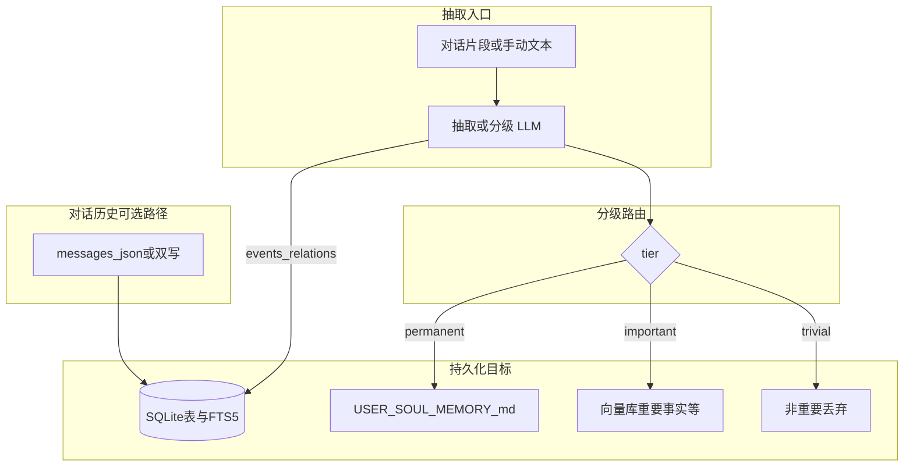

# AI 智能体 ruyi72 记忆系统（永驻 + 事件）设计（v2.0）

> **文档性质**：目标架构与里程碑设计，**非**当前代码实现说明。实现状态以 [AI智能体ruyi72 记忆系统（永驻+事件）设计（v1.0）.md](AI智能体ruyi72%20记忆系统（永驻+事件）设计（v1.0）.md) 及源码为准。  
> **排期声明**：下文阶段划分与验收标准为产品/技术对齐用，**不构成交付承诺**。

## 一、定位与读者

| 维度 | v1.0 文档 | v2.0 本文 |
|------|-----------|-----------|
| 内容 | 已实现：JSONL、`browse_memory`/`search_memory`、抽取器、闲时任务 | 目标：事实三级、SQLite+FTS5、向量、身份 Markdown 治理、迁移与工具契约 |
| 读者 | 维护现有记忆代码、对照行为 | 评审演进路线、拆分迭代、约定抽取 JSON 扩展字段 |

**与「永驻 + 事件」**：**永驻**指经分级后进入身份 Markdown 或长期稳定载体的事实；**事件**指带时间线的 Event 及 EventRelation，在 v2.0 中与对话 FTS、溯源字段强绑定。

## 二、总览架构



**数据流摘要**：

1. 抽取结果中的 **facts** 经 **`tier`** 分流：非重要不落库；重要入向量；永驻进入身份 Markdown 合并管道（建议默认需用户确认）。  
2. **events** / **relations** 以结构化行写入 SQLite（可从 v1 jsonl 迁移），并与 `source_session_id`、可选 `source_message_ids` 关联。  
3. **对话正文** 可迁移或双写到 SQLite，对 `content` 等列建 **FTS5**，与向量检索分工（字面/短语 vs 语义）。

## 三、事实三级（核心）

### 3.1 与 v1.0 行为差异

| 项目 | v1.0 实现 | v2.0 目标 |
|------|-----------|-----------|
| 非重要事实 | 仍写入 `facts.jsonl`（只要 key/value 非空） | **不写入**任何长期存储；抽取管道内丢弃 |
| 重要事实 | 与永驻混在同一 jsonl | **仅**入向量索引（及可选元数据表） |
| 永驻事实 | 与重要混在同一 jsonl | **不**默认进 `facts.jsonl`；经分类写入 `USER.md` / `SOUL.md` / `MEMORY.md` 合并区 |
| `confidence` / `tags` | 仅存储 | 可作为 **tier 辅助信号**（阈值、规则或二次分类模型） |

### 3.2 枚举与语义建议

| `tier` 建议值 | 含义 | 持久化 |
|---------------|------|--------|
| `trivial` | 一次性、低价值、噪声 | 不落库 |
| `important` | 需语义召回、非身份根文案 | 向量库 + 可选 SQLite 元数据行 |
| `permanent` | 长期影响人格/用户画像/核心记忆 | 身份 Markdown 合并（见 3.4） |

可选：由独立「分类」步骤对 LLM 原始 facts 做裁决，以降低单次抽取 prompt 负担。

### 3.3 重要事实与向量库

- **嵌入对象**：至少包含 `summary` 或与 `key`+`value` 拼接的规范化文本；可附带 `tags`、`created_at` 供过滤。  
- **嵌入模型（已定稿）**：本机 **Ollama** 部署 **`qwen3-embedding:8b`**。调用与现有 LLM 同属 Ollama HTTP 生态（如 **`POST /api/embed`**，具体路径以 Ollama 版本为准）；**向量维度**、批大小与超时以实现侧探测与配置为准。  
- **向量索引后端**：与 embedding 模型解耦，可采用 sqlite-vec、本地文件索引等；**索引后端选型**仍可在实现迭代中确定。  
- **工具演进**：`browse_memory` / `search_memory` 可增加「向量通道」参数或独立工具；与 FTS 结果可 **RRF 合并**或 **先 FTS 后向量扩召回**。

### 3.4 永驻事实与 USER.md / SOUL.md / MEMORY.md

与现有注入机制对齐（见 `src/llm/ruyi72_identity_files.py`）：

| `identity_target` 建议值 | 目标文件 | 典型内容 |
|--------------------------|----------|----------|
| `user` | `USER.md` | 用户画像、称呼、职业偏好等 |
| `soul` | `SOUL.md` | 智能体人格、语气边界（若事实确属人格层） |
| `memory` | `MEMORY.md` | 用户确认要长期记住的条款式记忆 |

**写盘治理（强烈建议写进产品规则）**：

- **策略 A（默认推荐）**：永驻事实先进入 **待合并队列**（应用数据或草稿文件），界面 **一键预览 diff → 用户确认** 后再追加/合并到上述 Markdown。  
- **策略 B**：受信环境下自动追加到固定区块（如 `<!-- ruyi72-auto-memory -->`），保留条数上限与去重键（如 `key`）。  
- **冲突**：同 `key` 新值覆盖旧值 / 保留多条版本 / 人工裁决 —— 需在实现前选定并写入配置。

## 四、事件与关系（「+事件」）

### 4.1 SQLite 表模型（目标）

在 v1.0 字段基础上扩展，示例（列名可随实现微调）：

**`memory_events`**

- **与现有 `Event` 对齐（保留）**：`id`, `created_at`, `time`, `location`, `action`, `result`, `metadata`(JSON)  
- **v1 扁平参与者（兼容）**：`actors`(JSON 数组，可选)。迁移或旧抽取仅输出 `actors` 时仍可读；新协议优先使用主客体字段。  
- **溯源**：`source_session_id`（可选，TEXT）、`source_message_ids`（JSON 数组，可选）、`extracted_at`（可选）  
- **主客体角色（NLP 事件结构）**：  
  - `subject_actors`（JSON 数组）：**主体角色**，执行动作的一方（如「如意72」「该公司」）。  
  - `object_actors`（JSON 数组）：**客体角色**，动作的承受者或相关对象（如「用户」「破产程序」）。  
- **触发词**：`triggers`（JSON 数组，字符串）：标示事件类型的核心词，动词或名词均可；同一事件可多个触发词（如「宣布」「破产」共同锚定「破产」类事件）。  
- **断言**：`assertion`（TEXT，应用层或 CHECK 约束枚举）：话语中该事件的**事实性状态**，见下 §4.1.1。缺省迁移与兼容策略见 **第七节**。

**`memory_relations`**

- **主键与边**：`id`, `created_at`, `event_a_id`, `event_b_id`（有向边语义由 **`relation_type`** 定义，见下 §4.1.2）。  
- **`relation_type`**：`INTEGER NOT NULL`，取值 **1–11**；数据库可加 `CHECK(relation_type BETWEEN 1 AND 11)` 或由应用层校验。  
- **`explanation`**：`TEXT`，人类可读说明；类型 **11（其它关系）** 时**必须**填写。  
- **`relation_legacy`（可选）**：`TEXT`，仅用于从 v1 迁移时保留原自然语言 `relation` 字段；新写入可为空。  
- **扩展**：`source_session_id`（可选）。  
- v1 的 **`relation` 字符串**不再作为 v2 主字段；迁移与兼容见 **第七节**。

**`memory_facts`（若仍需行存重要/过渡事实）**

- v2.0 中 **重要事实** 以向量为主时，本表可仅存 **向量 id、key、summary、tier、created_at** 等元数据，便于审计与 FTS 补充；**非重要不应出现**。

### 4.1.1 触发词与断言（NLP 语义说明）

在信息抽取/事件抽取任务中，**触发词**标明「发生了什么类型的事件」；**断言**标明该事件在话语中是**肯定、否定、可能还是未发生**，二者互补。

- **触发词**：通常是动词或名词，决定事件类型锚点。例如「该公司**宣布**破产」中「宣布」为触发词之一；「发生了一起车祸**事故**」中「事故」可视为触发词。  
- **断言**：描述确定性状态，而非重复 `action`/`result` 的叙事。建议枚举：  
  - `actual`：肯定/已发生（如「他辞职了」）。  
  - `negative`：否定（如「他没有辞职」；或话语整体否认某事件，见下例）。  
  - `possible`：可能（如「他可能辞职」）。  
  - `not_occurred`：预期发生但实际未发生。

**文档层示例**（不要求模型单次抽取必完美）：句子「公司**否认**将**宣布**破产。」可解析为：触发词候选包含「宣布」「破产」（锚定破产相关事件类型）；表层否定「否认」与「将」共同指向 **`assertion` = `negative`**（公司否认，故「破产已发生」不被话语肯定）。实现时可把否定Cue写入 `metadata` 供调试。

### 4.1.2 事件关系 `relation_type`（整型枚举与有向语义）

**存储与抽取约定**：`relation_type = 0` 表示**无关系**——得到 **0** 时**不得**写入 `relations.jsonl` / `memory_relations`。

| `relation_type` | 名称 | `event_a` → `event_b` 语义 |
|-----------------|------|---------------------------|
| 0 | （无关系） | **不存储** |
| 1 | 因果 | **A 导致 B**（因 → 果） |
| 2 | 果因 | **A 为果、B 为因**（与类型 1 对偶，端点语义按本表读取） |
| 3 | 前后时序 | **A 早于 B** |
| 4 | 后前时序 | **A 晚于 B** |
| 5 | 条件 | **A 是 B 成立的前提**（条件 → 结果） |
| 6 | 逆条件 | **A 为结果侧、B 为条件侧**（与类型 5 对偶） |
| 7 | 目的 | **A 为达成 B 而发生**（手段/行动 → 目标） |
| 8 | 逆目的 | **A 为目标、B 为手段**（与类型 7 对偶） |
| 9 | 子事件 | **A 是 B 的子事件**（子 → 父） |
| 10 | 父事件 | **A 是 B 的父事件**（父 → 子，即 B 为 A 的子事件） |
| 11 | 其它关系 | 弱类型或待人工标注；**须**有 `explanation` |

### 4.2 FTS5 范围

- **事件**：对 `action`、`result`、`triggers`（可拼接为单列或纳入 FTS 内容表）、以及主客体名称的**拼接辅助列**（若实现上采用 `participants_fts` 生成列）建 FTS；`source_session_id` + 时间范围 + 关键词组合查询。  
- **`assertion`**：宜作 **结构化过滤**（`WHERE assertion = 'actual'` 等），**不必**纳入 FTS 全文索引。  
- **关系**：对 **`explanation`**（及可选 `relation_legacy`）建 FTS；**`relation_type`** 用整数 **`WHERE` 过滤**，不必进 FTS。  
- **对话消息**（若迁移）：对 `content` 建 FTS；`session_id`、`role`、`created_at` 结构化过滤。  
- **与向量**：FTS 负责**字面命中**；向量负责**同义与复述**；重要事实以向量为主时，FTS 可作为可选辅助列（若事实摘要入库）。

## 五、对话历史与 SQLite + FTS5

### 5.1 与 `messages.json` 的关系（三选一对比）

| 方案 | 做法 | 优点 | 风险 |
|------|------|------|------|
| **迁移** | 一次性导入 SQLite，之后以 DB 为准 | 单一真源、查询统一 | 需周密迁移与回滚 |
| **双写** | 写入会话目录同时写 DB | 兼容旧逻辑、渐进切换 | 一致性与性能成本 |
| **仅索引** | `messages.json` 仍为真源，DB 为只读索引副本 | 改动小 | 同步延迟、修复复杂 |

推荐在实现阶段根据团队体量选定；**检索 API** 应对上层隐藏差异（返回统一「消息片段 + 会话 + 分数」结构）。

### 5.2 检索 API 形态（目标）

- **内部**：`search_messages_fts(query, session_id?, limit)`、`search_events_fts(...)`。  
- **ReAct**：扩展现有记忆工具或新增 `search_history` 类工具；返回截断片段与引用 id，便于模型归因。

## 六、抽取协议 v2（JSON 契约）

### 6.1 `facts[]` 扩展

在 v1.0 的 `facts[]` 项上**扩展**（向后兼容期可同时支持无 `tier` 时默认 `important` 或 `trivial` 由配置决定，**需在实现时明确默认策略**）：

```json
{
  "facts": [
    {
      "key": "user.home_province",
      "value": "安徽",
      "summary": "用户来自安徽",
      "confidence": 0.92,
      "tags": ["profile"],
      "tier": "permanent",
      "identity_target": "user",
      "merge_hint": "追加到「地域」小节"
    }
  ],
  "events": [
    {
      "id": "e_1",
      "source_session_id": "sess_abc",
      "time": "2026-04-03 10:30",
      "location": "本地电脑",
      "subject_actors": ["如意72"],
      "object_actors": ["用户"],
      "triggers": ["整理", "目录"],
      "assertion": "actual",
      "action": "如意72 帮用户整理了桌面上的文件和项目目录",
      "result": "用户对整理结果很满意",
      "metadata": {"skill": "file-organizer"}
    },
    {
      "id": "e_2",
      "source_session_id": null,
      "time": "",
      "location": "",
      "subject_actors": ["该公司"],
      "object_actors": [],
      "triggers": ["宣布", "破产"],
      "assertion": "negative",
      "action": "话语中涉及公司宣布破产的传闻",
      "result": "公司否认，破产事件不被话语肯定为已发生",
      "metadata": {"cue_words": ["否认", "将"]}
    },
    {
      "id": "e_3",
      "source_session_id": "sess_abc",
      "time": "2026-04-04",
      "location": "本地电脑",
      "subject_actors": ["用户"],
      "object_actors": [],
      "triggers": ["完成", "报告"],
      "assertion": "actual",
      "action": "用户完成了一份报告",
      "result": "",
      "metadata": {}
    }
  ],
  "relations": [
    {
      "event_a_id": "e_1",
      "event_b_id": "e_3",
      "relation_type": 1,
      "explanation": "整理文件后用户次日完成报告（因果：event_a 为因，event_b 为果）"
    }
  ]
}
```

**`facts[]` 字段**

| 字段 | 必填 | 说明 |
|------|------|------|
| `tier` | 建议必填 | `trivial` \| `important` \| `permanent` |
| `identity_target` | `permanent` 时建议必填 | `user` \| `soul` \| `memory` |
| `merge_hint` | 否 | 供合并 UI 或自动分块使用 |

**`events[]` 字段（v2 契约）**

| 字段 | 必填 | 说明 |
|------|------|------|
| `id` | 否 | 可省略，后端生成 |
| `source_session_id` | 否 | 来源会话；手动抽取无上下文时可 `null` |
| `time` / `location` | 否 | 与 v1 同义 |
| `subject_actors` | 建议必填 | 执行动作的主体；可与 `object_actors` 均为空时退化为仅叙事（不推荐） |
| `object_actors` | 否 | 动作客体 |
| `triggers` | 否 | 字符串数组；无则实现可视为 `[]` |
| `assertion` | 建议必填 | `actual` \| `negative` \| `possible` \| `not_occurred`；缺省兼容见第七节 |
| `action` / `result` | 至少其一非空 | 与 v1 同义，人类可读摘要 |
| `metadata` | 否 | 可存否定Cue、技能名等 |
| `actors` | 否 | **仅兼容 v1**：若存在且无 `subject_actors`/`object_actors`，实现可将 `actors` 整体映射为 `subject_actors` 或按规则拆分（**启发式实现待定**） |

**`relations[]` 字段（v2 契约）**

| 字段 | 必填 | 说明 |
|------|------|------|
| `event_a_id` / `event_b_id` | 是 | 有向边两端；语义由 **`relation_type`** 决定，见 §4.1.2 |
| `relation_type` | 是 | 整数 **0–11**；**0 = 无关系，不得落库** |
| `explanation` | 类型 11 必填；其余建议填 | 人类可读；类型 11 必须说明为何归类为「其它」 |
| `relation` | 否 | **仅兼容 v1**：若 LLM 仍输出字符串 `relation` 而无 `relation_type`，后端应映射为整型；无法识别时 **`relation_type = 11`**，原字符串写入 **`relation_legacy`**（或 `metadata`） |

**与** [`memory_extractor.EXTRACT_SYSTEM_PROMPT`](../src/agent/memory_extractor.py) **的关系**：实现 v2 时需整体替换或追加系统提示段落，明确 `tier`/`identity_target`、**事件**上表枚举、**`relation_type` 整型表（§4.1.2）**及 **`relation_type=0` 不输出关系项**；并约束无效组合（如 `tier=trivial` 且带 `identity_target` 时应忽略 target）。

## 七、迁移与兼容

1. **jsonl → SQLite**：按行读取 `facts.jsonl` / `events.jsonl` / `relations.jsonl`，生成 `id` 去重后批量插入；历史 **无 `tier`** 的 fact 可标记为 `legacy` 或一次性规则映射为 `important` 入向量+元数据表。  
2. **旧 `events.jsonl` 行（无 v2 字段）**：建议默认 **`assertion` = `actual`**（与「已落库的叙事事件」默认相容）；**`triggers` = `[]`**；**`subject_actors` / `object_actors`**：若存在 `actors` 数组，可 **全部拷贝到 `subject_actors`** 作为保守默认，或留空由后续工具补全（**按产品选择一种并写进迁移脚本**）；**`source_session_id`**：无则 `NULL`。  
3. **旧 `relations.jsonl`（仅字符串 `relation`）**：写入 SQLite 时设 **`relation_type = 11`（其它关系）**，**`explanation`** 沿用原 `relation` 全文或与其合并；**`relation_legacy`** 存原字符串。可选：维护 **关键词 → int** 的小表（如含「因果」→1、「前置」→3 等）做批量提升，**实现可选**。  
4. **闲时抽取游标**（`memory_auto_extract_state.json`）：迁移后若抽取改为写 DB，需 **重置或双读** 游标策略，避免重复抽取同一段文本；建议迁移完成后单点推进新游标文件。  
5. **回滚**：保留 jsonl 导出能力或迁移前备份 zip，写入运维文档。

## 八、实施阶段与验收（里程碑）

| 阶段 | 内容 | 验收要点（一句话） |
|------|------|-------------------|
| M1 | 抽取协议 `tier` + 管道内丢弃 `trivial` | 非重要事实不再出现在 `facts.jsonl` |
| M2 | 重要事实入向量 + 检索路径可用 | 同义查询能命中重要事实，且不混入已丢弃 trivial |
| M3 | 永驻合并管道 + 默认用户确认 | 未确认前不覆盖 `USER.md`/`SOUL.md`/`MEMORY.md` 正文 |
| M4 | 事件/关系入 SQLite + FTS5 | 事件可按关键词与时间窗查询 |
| M5 | 对话历史迁移或双写 + FTS | 会话内全文检索可用且结果可引用 |
| M6 | ReAct 工具组合查询 | 单轮可调 FTS/向量/（可选）身份摘要，行为与配额可测 |

## 九、与 v1.0 文档的链接

- **当前实现对照**：[AI智能体ruyi72 记忆系统（永驻+事件）设计（v1.0）.md](AI智能体ruyi72%20记忆系统（永驻+事件）设计（v1.0）.md)  
- v1.0 **第六节**保留演进摘要并指向本文，避免双份长文同步困难。

---

## 十、开放决策（实现前需锁定）

- **向量索引后端**（如 sqlite-vec 等）的具体选型与部署形态（**embedding 模型**已定：见 §3.3 **`qwen3-embedding:8b`**）。  
- `tier` 缺失时的默认策略；  
- 永驻写盘策略 A/B 默认值；  
- `messages.json` 三选一方案与主读路径。
