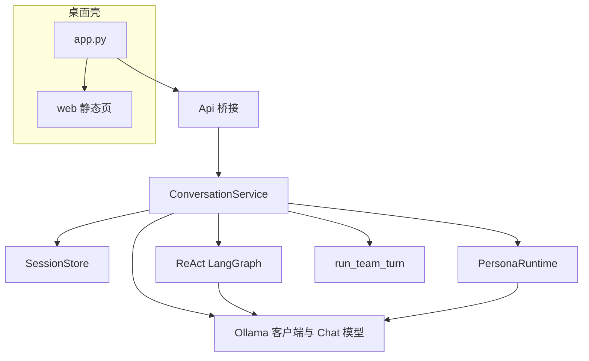

# 如意72 功能模块设计总览

本文描述桌面端各模块的**职责、关键入口、主要文件与模块间关系**。实现细节以源码为准；**团队模式**、**记忆系统**与**内置定时任务（设计草案）**另有专篇，此处仅摘要并给出链接。

## 总览关系

---

## 1. 桌面壳与 API 桥

**目的**：启动 PyWebView 窗口、加载本地 `web/index.html`，将 Python `Api` 实例暴露给前端 `window.pywebview.api`。

**关键文件**：[app.py](../app.py)

**要点**：

- `Api` 方法与会话、消息、配置快照、记忆、团队/知识库创建、工作区预览等一一对应；前端仅通过该方法与后端通信。
- `set_window` 注入主窗口后，由 `ConversationService.set_persona_emit` 将拟人事件经 `evaluate_js` 推到前端（`window.__ruyiPersonaEvent`）。

**边界**：不包含业务编排逻辑，只做转发与少量聚合（如 `get_settings_snapshot`）。

---

## 2. 配置

**目的**：从 YAML 与环境变量加载 `RuyiConfig`，供 LLM、窗口、团队槽位、拟人、存储路径等使用。

**关键文件**：[src/config.py](../src/config.py)、[config/ruyi72.example.yaml](../config/ruyi72.example.yaml)

**要点**：

- 配置文件查找顺序见根目录 README；未找到时使用代码内默认值。
- 与对话强相关的块：`llm`（主模型与 API）、`team.models`（团队专用，与顶层 `llm.model` 独立）、`persona`、`storage.sessions_root`、`agent.react_max_steps_default` 等。

**边界**：校验在加载期完成；运行时一般不热重载配置。

---

## 3. 会话与持久化

**目的**：按会话 ID 目录持久化 `meta.json`（元数据）与 `messages.json`（消息列表，含可选 `card`）。

**关键文件**：[src/storage/session_store.py](../src/storage/session_store.py)

**要点**：

- `SessionMeta`：`mode`（`chat` / `react` / `persona`）、`workspace`、`react_max_steps`、`session_variant`（`standard` | `team` | `knowledge`）、`team_size`（仅团队）、`kb_preset`（仅知识库，如 `general` / `ingest` / `summarize` / `qa`）。
- Pydantic 校验：`team` 必须带 `team_size`；`knowledge` 无 `team_size` 且可默认 `kb_preset`；`standard` 清除团队与知识库专用字段。
- 全文搜索会话用于侧栏搜索：[SessionStore.search_full_text](src/storage/session_store.py)。

**边界**：不负责调用 LLM；消息条目的语义由 `ConversationService` 写入规则决定。

---

## 4. 对话编排（核心服务）

**目的**：维护当前活动会话、处理用户发送、按模式分支调用 Chat / ReAct / 拟人 / 团队链路，并持久化消息。

**关键文件**：[src/service/conversation.py](../src/service/conversation.py)

**要点**：

- `ensure_session` / `open_session` / `create_session` / `create_team_session` / `create_knowledge_session` / `update_session` / `delete_session` 等。
- **工作区**：非团队、非仅拟人路径前，多数模式要求 `workspace` 为有效目录，工具与预览均限制在该根目录下（与 [tools.py](../src/agent/tools.py) 的 `safe_child` 一致）。
- **Chat**：临时注入系统块（安全技能摘要、`action_card` 说明等）；知识库会话额外拼接 [knowledge_prompts](../src/llm/knowledge_prompts.py)。
- **ReAct**：调用 [run_react](../src/agent/react_lc.py)，可传入知识库附加 system；结束后写回扁平消息并处理卡片。
- **拟人**：仅 `standard` 会话走 [PersonaRuntime](../src/agent/persona_runtime.py)；团队、知识库会话禁止或未启用拟人（见 `update_session` 校验）。
- **团队**：`run_team_turn`，配置来自 `team.models`；详见 [agent-team-mode.md](agent-team-mode.md)。
- **交互卡片**：解析见 [action_card.py](../src/agent/action_card.py)（支持 fenced 与 `<action_card>`）；确认后可能触发一轮 follow-up Chat。
- **UI 辅助 API**：`preview_workspace_file`（读文本文件）、`list_workspace_preview`（列目录元信息，不读文件内容）。

**边界**：不实现 HTTP 路由；所有入口来自 `Api`。

---

## 5. LLM 接入

**目的**：以 Ollama 兼容 API 发起 chat；为 LangChain 提供 `ChatModel`。

**关键文件**：

- [src/llm/ollama.py](../src/llm/ollama.py)：非流式 `OllamaClient.chat`、鉴权与 `trust_env` 等。
- [src/llm/chat_model.py](../src/llm/chat_model.py)：`chat_model_from_config`，供 ReAct 使用。
- [src/llm/ollama_stream.py](../src/llm/ollama_stream.py)：`stream_chat`，供 **拟人模式**流式输出（由 [persona_runtime.py](../src/agent/persona_runtime.py) 引用）。

**边界**：不缓存对话历史；历史由 `SessionStore` + `ConversationService` 维护。

---

## 6. ReAct 与本地工具

**目的**：在工作区内只读/列目录/执行 shell（cwd 固定为工作区根），并可加载技能文档、查询记忆工具。

**关键文件**：

- [src/agent/react_lc.py](../src/agent/react_lc.py)：`create_agent` + LangGraph、`system_prompt` 拼装、可选 `extra_system`（知识库）。
- [src/agent/tools.py](../src/agent/tools.py)：`safe_child`、`tool_read_file` / `tool_list_dir` / `tool_run_shell`。
- [src/agent/react.py](../src/agent/react.py)：对 `react_lc.run_react` 的薄封装。

**工具列表（与界面右侧说明一致）**：`read_file`、`list_dir`、`run_shell`、`load_skill`、`browse_memory`、`search_memory`。

**边界**：高危技能内容在 `load_skill` 返回中提示用户确认；实际执行仍受 shell/用户约束。

---

## 7. 技能系统

**目的**：从仓库根目录 `skills/` 扫描 `SKILL.md`，按 `safe` / `act` / `warn_act` 分级注册，为对话与 ReAct 提供元信息与全文加载。

**关键文件**：[src/skills/loader.py](../src/skills/loader.py)

**要点**：`get_registry()` 缓存单例；`build_safe_skills_prompt` / `build_react_skills_block` 生成不同详略的提示片段。

**边界**：不自动执行技能内脚本；由模型与用户决策后通过 `run_shell` 等触发。

---

## 8. 拟人模式

**目的**：流式输出、可打断、可选思考过程展示；通过 JS 事件与前端协作。

**关键文件**：[src/agent/persona_runtime.py](../src/agent/persona_runtime.py)

**要点**：`ConversationService` 持有 runtime 实例，与 `persona_send` / `persona_interrupt` / `persona_pause` / `persona_resume` 等 API 对应；事件经 `Api.set_window` 注入的 `evaluate_js` 推送。

**边界**：与团队、知识库会话互斥策略由 `update_session` 与 `send_message` 分支保证。

---

## 9. 团队模式（摘要）

**目的**：在单会话内按 `team.models` 配置多个模型槽位，链式委派直至末位收口。

**专篇**：[agent-team-mode.md](agent-team-mode.md)（场景、约束、`team_size` 上界、与顶层 `llm` 区分等）。

**代码入口**：[src/agent/team_turn.py](../src/agent/team_turn.py)，由 `ConversationService.send_message` 在 `session_variant == "team"` 时调用。

---

## 10. 知识库会话

**目的**：`session_variant=knowledge` 时，在 Chat / ReAct 的 system 中注入「工作区即知识库根」与预设任务侧重点（收录整理、摘要索引、问答等）。

**关键文件**：

- [src/llm/knowledge_prompts.py](../src/llm/knowledge_prompts.py)：从 [resources/knowledge_base/](../resources/knowledge_base/) 读取 `common.md` 与 `presets/*.md`。
- 创建逻辑：[SessionStore.create_knowledge_session](../src/storage/session_store.py)、`ConversationService.create_knowledge_session`。

**边界**：不内置向量检索；依赖现有工具链浏览文件。

---

## 11. 记忆系统（摘要）

**目的**：跨会话结构化存储事实、事件、关系；支持关键词检索与在 ReAct 中的只读工具。

**专篇**：[memory-system.md](memory-system.md)

**相关代码**：[src/storage/memory_store.py](../src/storage/memory_store.py)、[src/agent/memory_extractor.py](../src/agent/memory_extractor.py)、[src/agent/memory_tools.py](../src/agent/memory_tools.py)；前端「记住 / 浏览记忆」经 `Api.extract_memory` / `browse_memory`。

---

## 12. 前端（Web UI）

**目的**：侧栏会话列表与分组、搜索、工作区与模式、消息展示与 action_card 交互、主题色、右侧任务上下文与技能列表、提示词模板条、分屏下列出工作区目录元信息。

**关键文件**：[web/index.html](../web/index.html)、[web/app.js](../web/app.js)、[web/style.css](../web/style.css)

**要点**：

- 会话元数据驱动 UI：`session_variant`、`kb_preset`、团队人数等。
- `list_skills_compact`、`list_workspace_preview` 等仅展示与预览，不替代模型推理。
- 主题：`localStorage` + `data-theme` CSS 变量（见样式中 `:root` 与各预设）。

**边界**：无独立构建步骤；静态资源由 PyWebView 以本地文件加载。

---

## 13. 提示词与交互卡片

**目的**：统一 Agent 身份、安全说明、用户画像；可选 `action_card` 协议（Markdown 代码块或 `<action_card>` 包裹 JSON）。

**关键文件**：[src/llm/prompts.py](../src/llm/prompts.py)、[src/agent/action_card.py](../src/agent/action_card.py)

**要点**：`build_system_block` 拼接固定段与 `extra_system`；`split_reply_action_card` 从助手回复剥离卡片并校验 `v=1` 等字段。

**边界**：卡片持久化在消息的 `card` 字段，由 `sanitize_card_from_storage` 在读盘时校验。

---

## 14. 内置定时任务

**目的**：**会话级**与**全局**两类进程内定时计划（与技能生态中的外部定时区分）。

**专篇**：[scheduled-tasks-design.md](scheduled-tasks-design.md)

**实现概要**（以源码为准）：

- 模块目录：[src/scheduler/](../src/scheduler/)（模型、持久化、`scheduling` 的 next 计算、执行器、后台线程、`crud`）。
- 持久化：`sessions/<id>/scheduled_tasks.json`，`~/.ruyi72/global_scheduled_tasks.json`。
- 触发器：`interval_sec`、`daily_at`（本地 HH:MM）；动作：`noop`、`append_system_message`（全局仅 `noop`）。
- 与 `ConversationService`：`append_message_from_scheduler`、`is_session_active`；执行在进程空闲（`is_idle_for_auto_memory`）时进行；`missed_run_after_wake` 等字段已建模，唤醒补跑策略可后续对齐专篇。

**API**（`Api`）：`list_scheduled_tasks`、`save_scheduled_task`、`delete_scheduled_task`。

**边界**：Web UI 可后续接入；`call_llm_prompt` 等未实现。

---

## 修订记录

- 文档随仓库演进手工维护；若接口或 UI 行为变更，请同步更新本节与 [docs/README.md](README.md)。
