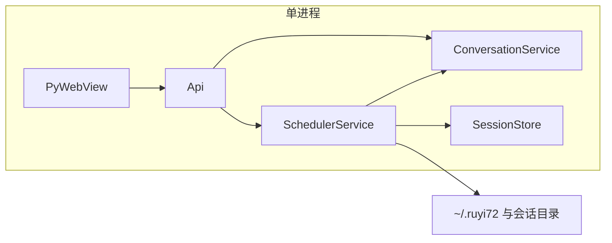

# 会话级与全局定时任务 — 设计文档（草案）

## 1. 背景与目标

- **背景**：应用为单进程 PyWebView + Python 后端（[`app.py`](../app.py)），已有后台守护线程先例（如 [`memory_auto_extract`](../src/agent/memory_auto_extract.py)）。用户希望**产品内置**两类定时能力，与技能目录里「用 schtasks 管 Windows 任务」等**外部**自动化区分开。
- **目标**：
  - **会话级任务**：绑定 `session_id`，仅在会话仍存在且满足条件时触发；典型用途：本对话的每日提醒、周期性摘要、跟进某话题。
  - **全局任务**：不绑定单一会话，与「当前打开哪个会话」无关；典型用途：全局健康检查、跨会话的轻量维护（如仅在空闲时合并记忆游标以外的维护类逻辑——具体动作可后续定义）。
- **非目标（v0 设计不承诺）**：跨设备同步、毫秒级精度、与操作系统任务计划程序双向同步、在 Web UI 完成复杂 Cron 编辑器（可列为后续）。

---

## 2. 术语

| 概念 | 含义 |
|------|------|
| **Schedule / 计划** | 一条「何时触发 + 触发后做什么」的定义。 |
| **会话级计划** | `session_id` 必填；状态与会话目录或元数据关联。 |
| **全局计划** | `session_id` 为空或专用标记；状态存放在用户级目录。 |
| **触发器** | 时间驱动（间隔 / cron 子集）或事件驱动（会话打开、应用启动）的可扩展点。 |
| **动作** | 触发时执行的内置操作（见第 5 节）。 |
| **调度器** | 进程内单例线程（或单线程 + 优先队列），统一 `sleep` / `wait`，避免每计划一线程。 |

---

## 3. 与现有架构的关系

- **调度器**为新组件（命名示例：`SchedulerService` / `builtin_tasks` 模块），在 `main()` 中与现有 `ConversationService` 一并构造，**早于或晚于** `webview.start()` 均可，但须在**同一进程**内运行。
- **会话级**读写：优先在会话目录 [`sessions/<id>/`](../src/storage/session_store.py) 增加 `scheduled_tasks.json`（或并入 `meta.json` 的扩展字段，见第 6 节），便于随会话备份/删除。
- **全局**读写：例如 `~/.ruyi72/global_scheduled_tasks.json`，与会话无关。
- **与闲时记忆线程**：二者共享「空闲」语义时可复用 [`is_idle_for_auto_memory`](../src/service/conversation.py) 或抽象为更一般的 `is_system_idle()`；若某全局任务不调用 LLM，可允许与记忆抽取并行（设计层先预留 `requires_llm: bool`）。

---

## 4. 会话级 vs 全局 — 对比

| 维度 | 会话级 | 全局 |
|------|--------|------|
| 持久化位置 | `sessions/<sessionId>/scheduled_tasks.json`（建议） | `~/.ruyi72/global_scheduled_tasks.json` |
| 生命周期 | 随会话删除而删除（或级联清理） | 与应用安装目录/用户目录共存 |
| 默认是否启用 | 可按会话模式限制（如仅 standard chat/react） | 一次配置全局生效 |
| 执行上下文 | 可注入「当前会话消息摘要」「会话标题」 | 仅全局配置；若需发消息需指定 `target_session_id` 或「当前活动会话」策略 |
| 典型触发 | 每 N 分钟检查本会话是否有新内容可摘要 | 每天固定时刻执行跨会话统计 |
| 未打开会话时 | 默认仍调度、仅写盘（`messages.json` / `task_runs.log`）；可通过 `run_when_session_inactive` 改为仅已加载时执行 | 与「是否打开某会话」无关；见全局动作定义 |

---

## 5. 触发器与动作（可扩展枚举）

**触发器（v1 建议子集）**

- `interval_sec`：固定间隔，进程内单调时钟，**不保证**休眠唤醒后的精确对齐。
- `daily_at`：本地时区 `HH:MM`（需明确使用 `datetime` 本地时区或配置 `timezone` 字段）。
- `on_session_open` / `on_app_start`（可选，事件型，实现复杂度高于纯定时，可列 P2）。

**动作（v1 建议最小集合，均可扩展）**

- `noop`：仅写日志，用于验证调度链路。
- `append_system_message`：向**本会话**追加一条 `system` 或 `user` 可见的提示（需产品决定是否展示 system）。
- `inject_reminder`：通过现有消息通道插入一条 assistant 占位或侧栏通知（与前端协议需单独立项）。
- `call_llm_prompt`：使用固定模板 + 本会话最近 K 轮对话调用 LLM（**必须**走统一 `llm_busy`，与现有一致）。
- `run_memory_extract_slice`：对「本会话自上次游标以来」文本调用抽取（与 [`memory_auto_extract`](../src/agent/memory_auto_extract.py) 游标关系需定义：要么复用游标，要么会话级独立游标——**设计建议**：会话级任务若只做「增量摘要」可用独立字段，避免与全局自动抽取打架）。

---

## 6. 数据模型（草案）

**单条计划（JSON 对象）**

- `id`：UUID
- `kind`：`session` | `global`
- `session_id`：`string | null`
- `enabled`：`bool`
- `trigger`：`{ "type": "interval_sec", "value": 3600 }` 或 `{ "type": "daily_at", "value": "09:00" }`
- `action`：`{ "type": "call_llm_prompt", "template_id": "session_daily_review", "max_context_messages": 20 }`
- `next_run_at` / `last_run_at`：ISO8601 字符串（可选，由调度器维护，减少重复计算）
- `version`：模式版本号，便于迁移
- **会话级可选（未打开会话时的行为）**
  - `run_when_session_inactive`：`bool`，默认 `true`。为 `true` 时：即使用户当前**未在前台打开**该会话，调度仍执行，**仅写磁盘**，不依赖 UI 是否展示该会话。为 `false` 时：**仅当**本会话已在应用内打开/加载（例如当前活动会话或会话列表中已载入）时才执行；否则本轮跳过（实现可约定是否入队顺延）。
  - `persist_output_to`：`"messages"` | `"task_runs_log"` | `"both"`（默认建议 `messages` 或按动作类型默认）；执行结果写入 [`messages.json`](../src/storage/session_store.py) 中对应条目，和/或会话目录下独立 `task_runs.log`（JSONL 或轮转文本，便于审计与不入主对话流）。
- **`daily_at` 与休眠唤醒（创建时可选）**
  - `missed_run_after_wake`：`"catch_up_once"` | `"skip"`。长时间合盖睡眠后进程内时钟可能跨过多次计划时刻：唤醒后要么**至多补跑 1 次**再按正常节奏排 `next_run_at`，要么**不补跑**、从唤醒后的下一次计划继续。用户在**创建/编辑计划时**选择其一；若选 `skip`，即「不跑」错过的触发。

**会话目录文件示例**：`scheduled_tasks.json` 为 `{ "tasks": [ ... ] }`。

---

## 7. 调度循环（进程内）

1. 维护**小顶堆**或按 `next_run_at` 排序列表；主循环 `sleep(min(下一触发, 上限))`。
2. 每次唤醒：加载全局计划 + 扫描「当前已加载会话列表」或「磁盘上最近 M 个会话」的会话级计划（避免每次全量扫盘，可配置 `max_session_dirs_scanned`）。
3. 对到期任务：
   - 若 `requires_llm` 且 `not idle`：可**顺延** `next_run_at`（避免饿死），或**跳过本轮**下周期再试（策略二选一，建议实现时写死 v1 行为）。
   - 会话级：若 `run_when_session_inactive == false` 且本会话未加载，则本轮不执行或顺延（与 §11 一致）。
   - 若触发器为 `daily_at` 且刚从长时间休眠唤醒：按该计划的 `missed_run_after_wake` 执行**至多一次补跑**或**跳过补跑**（见 §11）。
   - 执行动作时进入 `llm_busy()`（若适用）。
4. 执行后更新 `last_run_at`、计算下一 `next_run_at`。

---

## 8. API 与 UI（已实现要点）

- **设置 → 全局定时任务**：创建（当前仅 `noop`）、列表、删除；数据在 `~/.ruyi72/global_scheduled_tasks.json`。
- **主界面「本会话定时任务」**（须先选中会话）：创建 `noop` / `append_system_message`、列表、删除；数据在 `sessions/<id>/scheduled_tasks.json`。
- **「定时任务记录」**（全屏只读）：聚合 `~/.ruyi72/global_task_runs.log` 与各会话目录 `task_runs.log` 的**尾部**（扫描会话数受 `builtin_scheduler.max_sessions_scanned` 等限制）。
- **Api**：`list_scheduled_tasks`、`save_scheduled_task`、`delete_scheduled_task`、`list_scheduled_task_runs`（只读，不写盘）。
- **ReAct 工具**：`save_session_scheduled_task`（参数见 [`src/agent/react_lc.py`](../src/agent/react_lc.py)），固定绑定**当前会话 id**，模型不可改会话。

---

## 9. 安全与资源

- 单计划**执行超时**、**LLM 调用次数/日**上限。
- 全局任务禁止默认执行 `run_shell`；若未来允许，必须与 ReAct 工作区策略一致并单独开关。
- 日志脱敏：不在 INFO 日志打印完整用户对话。

---

## 10. 与技能「定时」的边界

- **技能**（如 `schedule-manager`、`daily_summarizer`）可使用用户工作区或独立存储，属于**用户脚本/技能生态**。
- **本文档**定义的是**应用内核**调度，存储在应用约定的 `~/.ruyi72` 与会话目录，由官方后端实现与 UI 暴露（逐步实现）。

---

## 11. 产品规则（已拍板）

### 11.1 会话级：用户未打开该会话时

- **默认**：触发时间到达时**仍执行**（不依赖用户是否正在查看该会话）；**仅持久化**，不强制切换前端会话。
- **结果落盘**：写入 `messages.json`（作为一条或多条可追溯消息，便于侧栏打开后可见），和/或会话目录下独立 **`task_runs.log`**（便于与主对话流分离、审计）；由计划的 `persist_output_to` 指定。
- **创建/编辑时的选项**：`run_when_session_inactive`（默认 `true`）。若用户选择 **「未打开会话时不执行」**（即 `false`），则仅在本会话已被应用加载/处于可写状态时才运行；否则本轮不跑（实现可定义是否顺延）。与「可以选择不打开」相对应的另一面是：默认允许**不打开**会话也能在后台完成写盘任务。

### 11.2 `daily_at` 与长时间休眠唤醒

- 合盖睡眠期间进程内多次「应触发」的时刻会**错过**。
- **创建/编辑计划时的选项**：`missed_run_after_wake`：
  - **`catch_up_once`**：唤醒后**至多补跑 1 次**，再按规则计算下一次 `daily_at`；
  - **`skip`**：**不补跑**错过的触发，从唤醒后的下一次计划时刻继续（用户侧即「不跑」遗漏次数）。

**实现说明（v1，[`src/scheduler/worker.py`](../src/scheduler/worker.py)）**

- 未使用操作系统「休眠/唤醒」API；用**漏跑程度**区分「同一天略晚」与「跨日或多轮遗漏」，避免与「长时间非空闲不跑调度」混淆。
- **`catch_up_once`**：不单独改期；到期任务照常至多执行一次，再由 `advance_next_run` 计算下次。
- **`skip`**：仅当 `next_run_at` 已过期且判定为**多轮遗漏**时，**不执行**本轮，只把 `next_run_at` 推到下一次合理时刻：
  - `daily_at`：若 `next_run_at` 与当前时刻在**本地日历日**上已不在同一天（跨日），则 `next_run_at =` 下一个本地 `HH:MM`（`next_fire_daily_at_local`）。
  - `interval_sec`：若迟到时长 `≥ 2 × interval`，视为漏了至少两轮，则 `next_run_at = now + interval`。
- 同一天内仅迟到数分钟～数小时的 `daily_at` 仍会补跑至多一次（与「略晚」一致）。

---

## 12. 运行记录（审计）

- **全局**：[`src/scheduler/executor.py`](../src/scheduler/executor.py) 在执行全局 `noop` 时向 `~/.ruyi72/global_task_runs.log` 追加一行 JSON（与 [`append_global_task_runs_log`](../src/scheduler/persistence.py)）。
- **会话**：同上文件在会话目录写 `task_runs.log`（当 `persist_output_to` 含 `task_runs_log` 或 `both` 时，noop/append 均可能写入，见 executor）。
- **只读聚合**：[`src/scheduler/runs_reader.py`](../src/scheduler/runs_reader.py) 供 `list_scheduled_task_runs` 使用；不保证全量历史，仅尾部切片以便 UI 展示。
